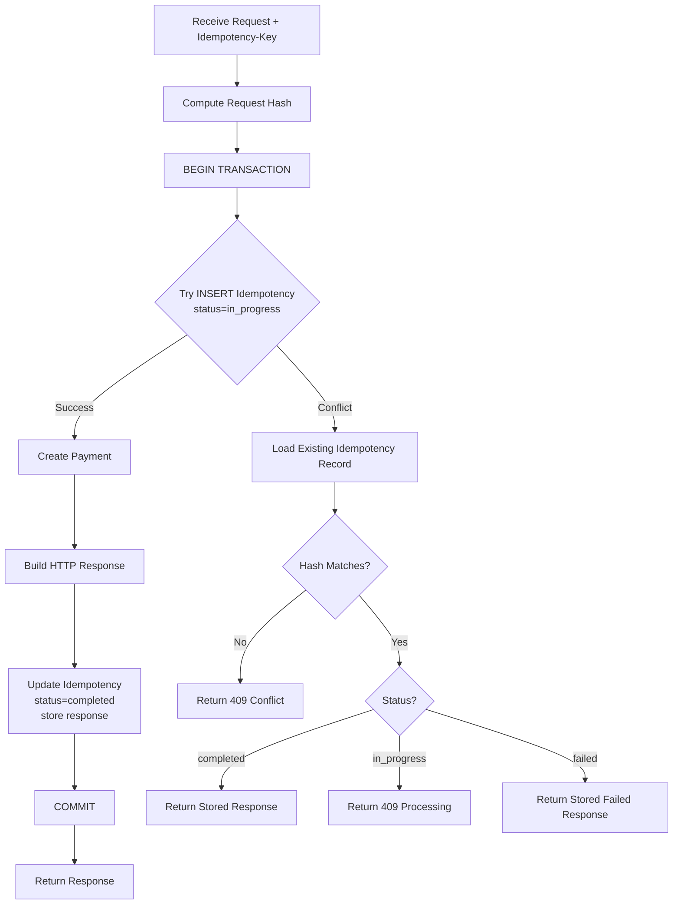

# Idempotent Payment Simulator

---

This project simulates a **payment processing service** written in Go that guarantees safe retries using idempotency, a critical requirement in real-world distributed systems.

In production environments, clients often retry payment requests due to timeouts, network failures, or user behavior. Without proper safeguards, these retries can result in duplicate charges and inconsistent system state.

The service is implemented in **Go** with **PostgreSQL** and requires clients to send an `Idempotency-Key` header with each payment request. When the same key is received more than once, the system returns the original stored response instead of processing the payment again, ensuring that each logical payment is executed only once.

---

## Technical Highlights

* Deterministic request hashing
* Atomic database constraints
* Transaction-safe payment processing
* Concurrency-safe idempotency handling
* High-performance Go HTTP server

---

## Complete flow of a transaction

## Idempotency Design Principles

- The Idempotency-Key registers the client’s intent before executing the payment.

- Only one request can successfully insert the key.

- If a conflict occurs:
  → The system validates that the request is identical (via request hash).
  → The response is determined by the persisted status.

- The Payment creation and the IdempotencyRecord update occur within the same transaction.

- Deterministic business errors may be persisted as failed.